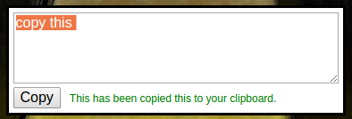

# Halogen Click-To-Copy

This child component provides a way to quickly copy the contents of a textarea.  If the browser doesn't support the
Clipboard API, then the text is highlighted and the user is instructed to press "Ctrl-C" or ""⌘-C".

* Todo
  - Examples + Demo
  - Tests
  - Provide default styles and add classes so style can be customized
  - Enable copy of elements other than textarea
  - Hide the confirmation text after a little while
